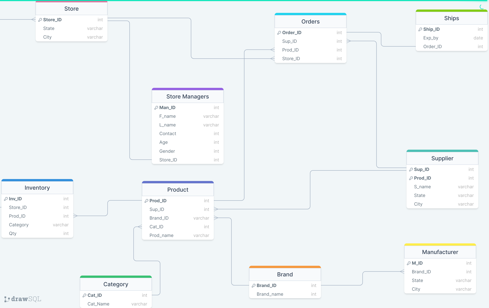
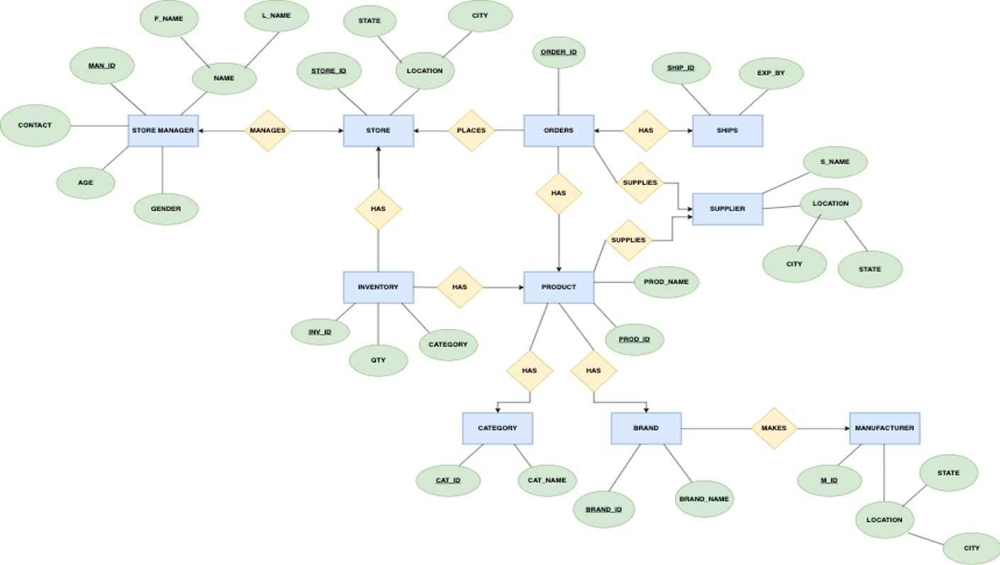

# Inventory_System
### Relational Database
## Table of Contents

  - [Introduction](#introduction)
  - [Schema](#advantages)
  - [ER Diagram](#advantages)
  - [Advantages](#advantages)
  - [Conclusion](#conclusion)
  

## Introduction

- An inventory management system is a combination of technology and processes and procedures that oversee the monitoring and maintenance of all stocked products, whether those products are company assets, raw materials and supplies, or finished products ready to be sent to vendors or end consumers. 
- This system can widely be used by normal shops or departmental stores for keeping a proper track of all the stock we have. 
- With the help of this system, we can fix a minimum quantity of any inventory below which we need to place an order for that inventory. 
- This will help us in good sales results and never be in an out-of-stock stage for any inventory of any sorts. 

## Schema

## ER Diagram

## Advantages

### Inventory Balance
- Our inventory management system helps you figure to out exactly how much inventory you need. This makes it easier to prevent any product shortages and to keep just enough inventory on hand without having too much to handle. 

### Inventory Turnover
- We need to keep a high inventory turnover ratio to ensure our products aren’t getting spoilt, getting obsolete or increasing our working capital.
-  Our system helps us understand our weekly inventory usage. 

### Accurate Planning
- Using our inventory management system, you can keep the right number of products on hand and plan for seasonal changes as time progresses. 
- This goes a long way in keeping your customers happy all year.

### Warehouse Organization
- If we know which of our products is our top seller and what combinations of products our customers often order together, we can optimize our warehouse setup by putting those products close together and in easily accessible places. 
- This helps to speeds up the picking, packing and shipping process. 

 
### Employee Efficiency
- We can empower our employees to help manage our inventory. 
- Training employees to use barcode scanners, inventory management software and other tools helps them make better use of their time. It also helps our business makes better use of its resources, both human and technological.  
- This is also safe from fraud because only the store managers are allowed to access the database.

### Inventory Orders
- If you’ve done a good job keeping track of how much inventory you have on hand, you can make smarter decisions about when and what to order. Inventory management software lets you speed up the ordering process. You can simply scan a product barcode and type in some information to place an order and generate an invoice. 

### Inventory Tracking
- Since we have multiple locations, then inventory management becomes even more important because we need to coordinate our supplies at each location depending on the differences in demand and other factors that come into the picture. 

### Time Saving 
- Inventory management is a great time-saving tool.
- By keeping track of all the products, you have on hand and on order, you can save yourself the hassle of doing inventory recounts to make sure your records are accurate. This once again requires inventory management software. 

## Conclusion
-In this project we developed a complete back end software in which we can update the stock, modify stock, we can forecast the stock, generate invoice.From this application we can get an update that if a particular inventory or stock is less than the some pre-fixed quantity then it’ll be easy for the manager/owner to reorder the product from supplier to overcome the “Out of Stock” stage. 
In addition to this it can also help us to manage the warehouses, add warehouses which can be proved as very useful feature.We can have complete customer details which can help us to retrieve theorder details of regular customers. 
From this program we can also keep a track of transactions performed by different customers/clients. We can also get an idea that how much fund we received from different payment methodologies. 
This application will keep a high inventory turnover ratio to ensure our products aren’t spoiling, becoming obsolete for our working capital. It’ll help us to calculate how many times inventory sells in a year and see where we can make better use of our resources. 

